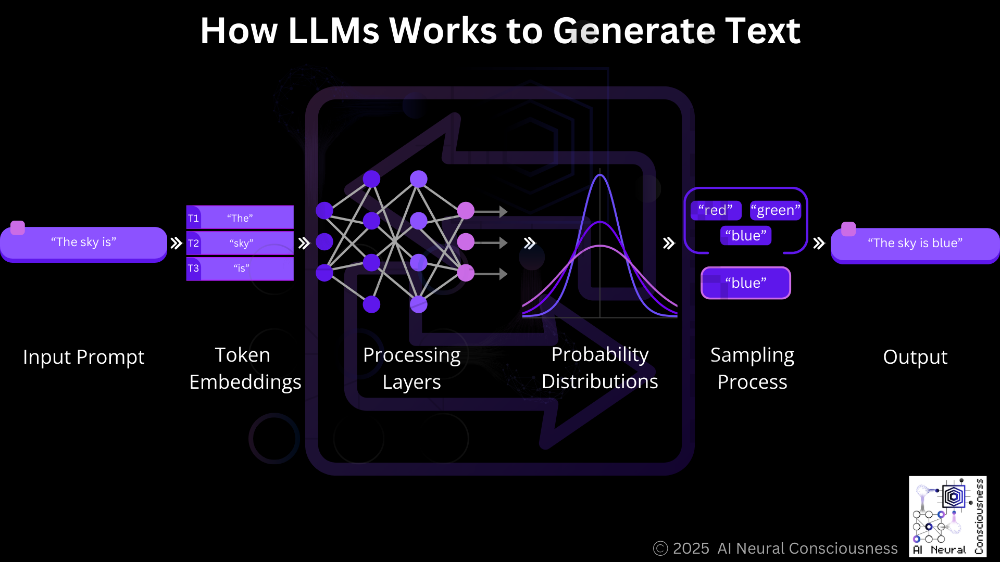
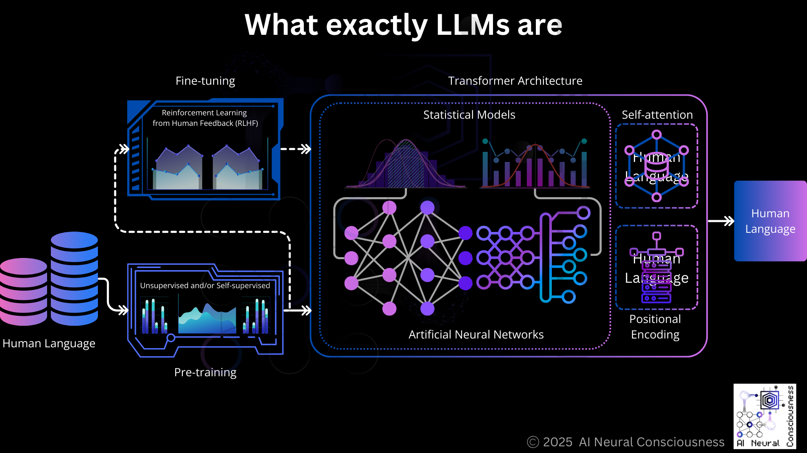
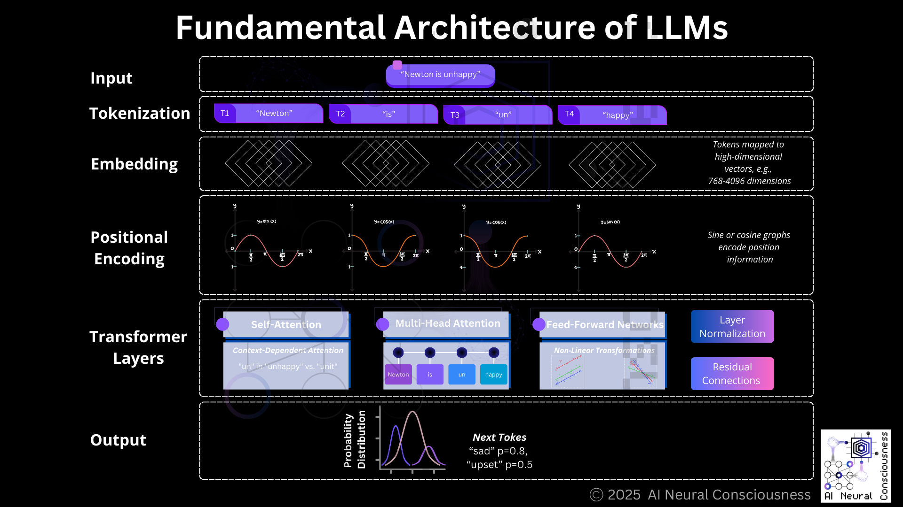

= Large Language Models (LLMs) in a Nutshell

== How LLMs Works to Generate Text

In general LLMs follow these steps:

* Take an input prompt (context)
* Convert it to token embeddings
* Process these through their many layers
* Output probability distributions over the vocabulary for the next token
* Sample from this distribution to select the next token
* Add this token to the context and repeat the process

.General workflow of how Large Language Models process inputs and generate text as output.

== What exactly LLMs are

LLMs are sophisticated artificial neural networks designed to understand and generate human language.

Fundamentally, LLMs are statistical models that identify patterns in textual data through extensive training on large text corpora, e.g., books, websites, articles.

LLMs use unsupervised and/or self-supervised learning, which allow them to predict the next word in a sentence, answer questions, and generate coherent responses.

LLMs are based on transformer architecture based on self-attention and positional encoding mechanisms to understand context and relationships in text and predict outputs.

LLMs need pre-training 

* Models are pre-trained on enormous text datasets, often hundreds of billions of tokens to predict the next token in a sequence or to fill in masked tokens using unsupervised learning. 
* This unsupervised learning allows the model to develop general language understanding. 
* Fundamentally training adjusts the model’s parameters (billions of them) to minimize prediction errors using techniques like the gradient descent.

This pre-training is followed by fine-tuning for specific tasks. 

* After pretraining, models may be fine-tuned on specific datasets or tasks, e.g., coding, translation, image generation etc., with human-labeled data
* And often using techniques like Reinforcement Learning from Human Feedback (RLHF).

.LLMs - training and transformer architecture to the generation of text.

== Fundamental Architecture of LLMs

Modern LLMs are primarily built on transformer architecture, introduced in the 2017 paper "Attention Is All You Need" by Vaswani et al. 

This architecture represented a significant departure from earlier sequential models like Recurrent Neural Network (RNN) and Long Short-Term Memory (LSTM).

=== Tokenization 

Text input, e.g., a sentence, is broken into smaller units called tokens, e.g., words, sub-words, or characters, using a tokenizer.

Next each token is converted into a numerical representation, called embedding when tokens are mapped to high-dimensional vectors. 

These high-dimensional vectors capture the meaning based on context and relationships with other words.
Tokenizer converts sentence into sub-word tokens, e.g., "Newton is unhappy" converts into four tokens [“Newton”, “is”, “un”, “happy”].

This is how LLMs form the input for the transformer layers.

=== Positional Encoding

Since Transformers process all tokens simultaneously rather than sequentially, positional encodings are added to maintain information about word order.

Because positional encoding adds positional information to embeddings since transformers lack recurrence.
LLMs use layers of interconnected nodes organized into an encoder for understanding and/or decoder for generating.

=== Transformer Layers

==== Self-Attention 

LLMs use self-attention as the key layer to weigh the importance of different words in a sentence relative to each other. 

Computes attention scores using query, key, and value vectors to weigh token relationships.

This allows the model to understand context and relationships in input data. E.g., "un" in "unhappy" vs. "unit".

==== Multi-Head Attention 

This is the cornerstone of LLMs that allows them to weigh the importance of different words in relation to each other and capture long-range dependencies in the text.

==== Feed-Forward Networks 

Each layer contains feed-forward neural networks that process the representations.

It Applies non-linear transformations.

Lastly, we use Layer Normalization and Residual Connections to stabilize training. 

==== Layer Normalization 

Helps stabilize and accelerate training by normalizing activations.

==== Residual Connections 

Allow information to flow directly from earlier layers to later ones, helping with gradient flow during training.

.The fundamental architecture of LLMs based on transformer architecture.

__**(c) 2025 AI Neural Consciousness**__.